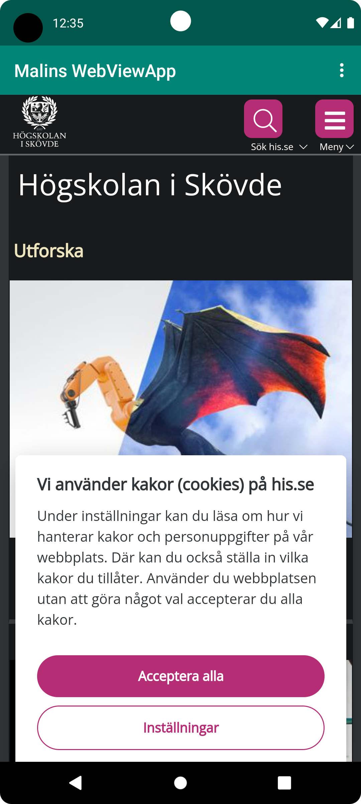
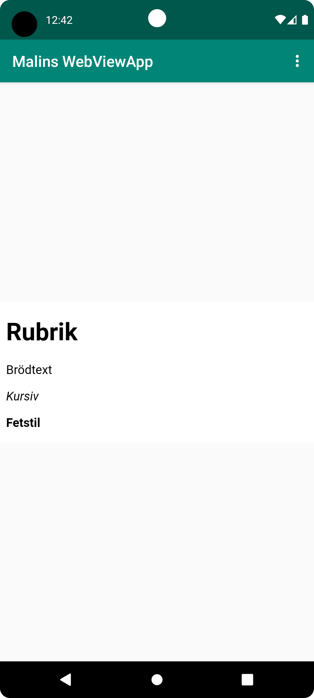

# Rapport

Jag började med att forka ett projekt från GitHub. Därefter gick jag in i Android Studio och 
öppnade projektet genom att välja File-New och sedan Project from version control. 
Där hittade jag mitt github konto och hämtade projektet. 

## Rename your App

I filen strings.xml och ändrades namnet till "Malins WebWiewApp".

Kod som ändrades:
```
<resources>
    <string name="app_name">Malins WebViewApp</string>
    <string name="action_external_web">External Web Page</string>
    <string name="action_internal_web">Internal Web Page</string>
</resources>

```
## Enable Internet access for your App

I mappen manifests och filen AndroidManifest.xml lades kod till för att skapa tillgång till internet för appen.

Kod som lades till:
```
<uses-permission android:name="android.permission.INTERNET" />

```

## Create a WebView element 

I layout och i filen `activity_main.xml` skapades ett Webview element genom att ändra från `TextView` till `WebView`.

Kod som ändrades: 
```
<WebView
android:layout_width="wrap_content"
android:layout_height="wrap_content"
android:text="@string/app_name"
app:layout_constraintBottom_toBottomOf="parent"
app:layout_constraintEnd_toEndOf="parent"
app:layout_constraintStart_toStartOf="parent"
app:layout_constraintTop_toBottomOf="@+id/appBarLayout" />
```

## Give the WebView an ID

Genom att lägga till koden `android:id="@+id/my_webview"`i layout och i filen `activity_main.xml`under funktionen WebView så fick 
WebViem funktionen ett ID. 

Kod som lades till, se första raden under WebView: 
```
<WebView
        android:id="@+id/my_webview"
        android:layout_width="wrap_content"
        android:layout_height="wrap_content"
        android:text="@string/app_name"
        app:layout_constraintBottom_toBottomOf="parent"
        app:layout_constraintEnd_toEndOf="parent"
        app:layout_constraintStart_toStartOf="parent"
        app:layout_constraintTop_toBottomOf="@+id/appBarLayout" />

```

## Create a private member variable called `myWebView` of the type `WebView` and instantiate it in `onCreate()`and Create a new WebViewClient to attach to the WebView

I `MainActivity.java` filen deklarerades en ny variabel av klassen WebView med namnet `myWebView`.
Denna variabeln deklareras direkt under Mainklassen, se ändrad kod (1). Variabeln skulle också vara en privat variabel, 
därför sattes "private" före klassen WebView. Därefter instansieras variabeln genom att tilldela nyckelordet `New` I detta fall
`new WebViewClient` som kopplas till WebView. Detta ger oss åtkomst till att surfa på webben. Koden som lades till finns i kod (2), se nedan. I detta skede visas alltså första sidan på appen `Malins WebVievApp` Skövde Högskolas webbsida som första sida genom att hämta data från loadUrl("https://his.se").


Kod (1) som skapades, se andra raden:

```
public class MainActivity extends AppCompatActivity {
private WebView myWebView;

    public void showExternalWebPage(){
        myWebView.loadUrl("https://his.se");
    }

    public void showInternalWebPage(){
        myWebView.loadUrl("file:///android_asset/assets.html");
    }
```

Kod (2) som skapades, se rad 7-9. Rad 3 visar att metoden onCreate ska starta upp i filen `activity_main.xml#:

```
protected void onCreate(Bundle savedInstanceState) 
{
        super.onCreate(savedInstanceState);
        setContentView(R.layout.activity_main);
        Toolbar toolbar = findViewById(R.id.toolbar);
        setSupportActionBar(toolbar);

        myWebView = findViewById(R.id.my_webview);
        myWebView.setWebViewClient(new WebViewClient()); // Do not open in Chrome!
        myWebView.loadUrl("https://his.se");
   }
 ```

## Enable Javascript execution in your WebViewClient

Javascript är inaktiverat i en WebView som standard. 
Genom att lägga till ny kod i filen `MainActivity.java` via WebSettings som är bifogat till WebView. 
Hämta WebSettings med getSettings(), och sedan aktivera JavaScript med setJavaScriptEnabled(), ge funktionen värdet true. 
På så sätt kan javascript läsas in i WebViewClient.

Kod som lades till, se kodrad 10-11: 

 ```
 protected void onCreate(Bundle savedInstanceState) 
 {
        super.onCreate(savedInstanceState);
        setContentView(R.layout.activity_main);
        Toolbar toolbar = findViewById(R.id.toolbar);
        setSupportActionBar(toolbar);

        myWebView = findViewById(R.id.my_webview);
        myWebView.setWebViewClient(new WebViewClient()); // Do not open in Chrome!
        myWebView.loadUrl("https://his.se");

        WebSettings webSettings = myWebView.getSettings();
        webSettings.setJavaScriptEnabled(true);
       
    }
 ```
## Add a html page as an asset

Skapa en asset folder genom att högerklicka på mappen `app`. 
Välj sedan `New` - `Folder` - `Assets Folder` och tryck på `Finish`. Nu har en ny folder skapats i projektet. Högerklicka på foldern och skapa en ny fil som döps till `asetts-html`


## Implement `showExternalWebPage()` and `showInternalWebPage()`.

I filen `MainActivity.java` ändrades kod för att lägga till External Webpage och Internal Webpage. 
External Webpage lades in som "https://his.se" och Internal Webpage lades in den skapade `asetts-html` filen. 

Kod som skapades: 

 ```
public class MainActivity extends AppCompatActivity {
    private WebView myWebView;

    public void showExternalWebPage(){
        myWebView.loadUrl("https://his.se");
    }

    public void showInternalWebPage(){
        myWebView.loadUrl("file:///android_asset/assets.html");

    }
 ```
Första sidan i appen skulle också vara blank, inte läsa in "https://his.se", 
så då togs kod bort från `MainActivity.java` i onCreate som är metoden som startar appen.

Koden innan, se rad 9. Den togs bort.

 ```
protected void onCreate(Bundle savedInstanceState) 
 {
        super.onCreate(savedInstanceState);
        setContentView(R.layout.activity_main);
        Toolbar toolbar = findViewById(R.id.toolbar);
        setSupportActionBar(toolbar);

        myWebView = findViewById(R.id.my_webview);
        myWebView.setWebViewClient(new WebViewClient()); // Do not open in Chrome!
        myWebView.loadUrl("https://his.se");

        WebSettings webSettings = myWebView.getSettings();
        webSettings.setJavaScriptEnabled(true);
       
    }
 ```
 
När koden såg ut så här, se nedan, läses en blank första sida in: 
 ```
protected void onCreate(Bundle savedInstanceState) 
 {
        super.onCreate(savedInstanceState);
        setContentView(R.layout.activity_main);
        Toolbar toolbar = findViewById(R.id.toolbar);
        setSupportActionBar(toolbar);

        myWebView = findViewById(R.id.my_webview);
        myWebView.setWebViewClient(new WebViewClient()); // Do not open in Chrome!

        WebSettings webSettings = myWebView.getSettings();
        webSettings.setJavaScriptEnabled(true);
       
    }
 ```

*External Webpage,"https://his.se"*


*Internal Webpage, "file:///android_asset/assets.html"*



